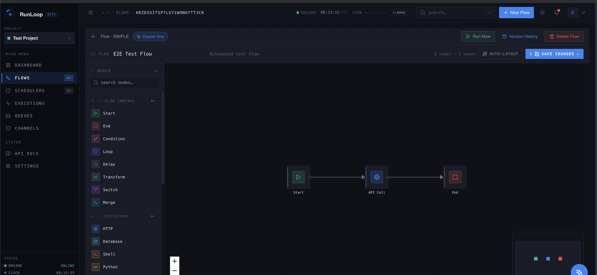
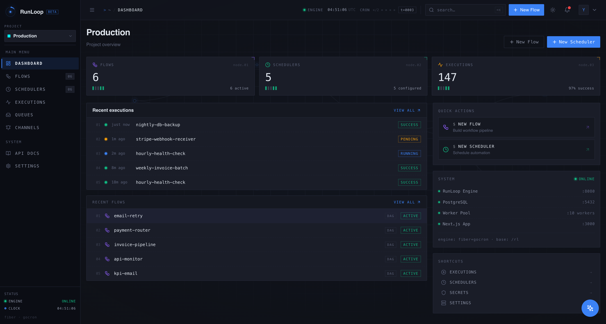
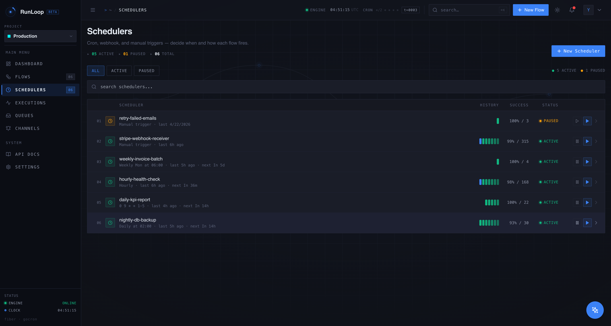
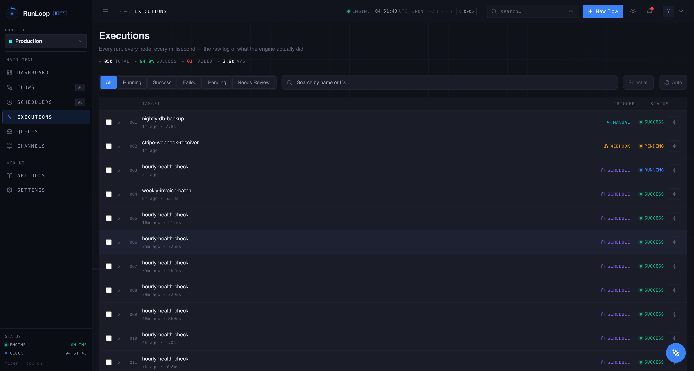
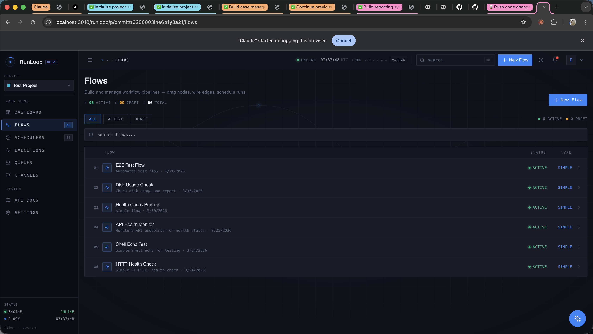
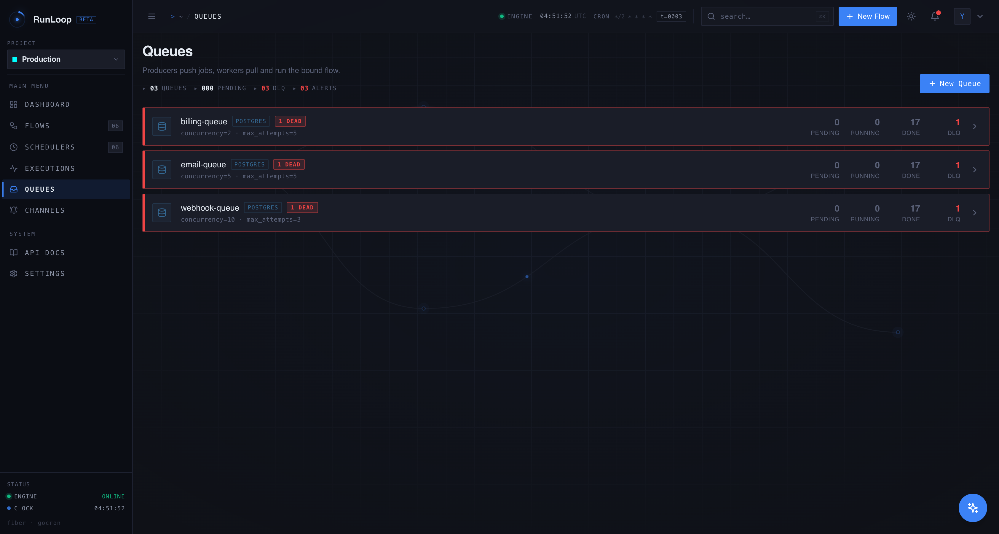
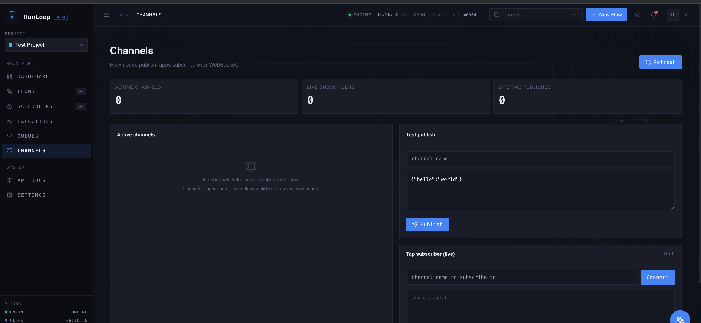
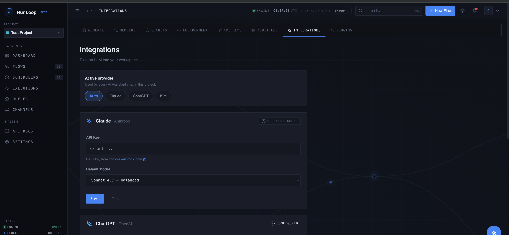
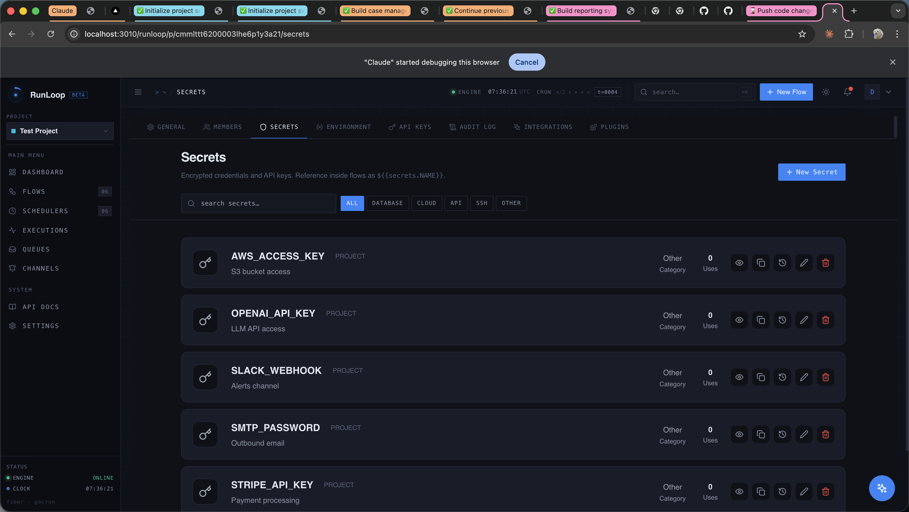
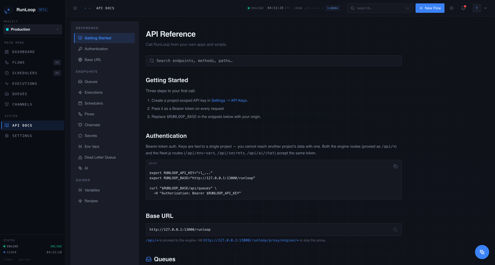

<div align="center">

# 🔁 RunLoop

**Open-source workflow engine for self-hosters.**

Drag-drop DAGs · cron schedules · 4 queue backends · code execution in 6 languages · pub/sub channels · AGPL.

[](https://github.com/EnterpriseX-Platform/RunLoop/actions/workflows/ci.yml)
[](https://github.com/EnterpriseX-Platform/RunLoop/releases)
[](https://www.gnu.org/licenses/agpl-3.0)
[](https://go.dev/)
[](https://nextjs.org/)
[](https://github.com/EnterpriseX-Platform/RunLoop/discussions)

</div>

---

<p align="center">
  
</p>

Visual DAG editor. Multi-runtime code execution. Pluggable queue backends.
Encrypted secret vault. WebSocket-streamed executions. Project-scoped
multi-tenant. All in three containers, under 140 MB RAM idle, AGPL-3.0.

```
┌──────────────┐   drag-drop    ┌──────────────┐   gocron + pg/redis/kafka  ┌─────────────┐
│  Flow Editor │ ─────────────▶ │  Scheduler   │ ─────────────────────────▶ │ Worker Pool │
│  (React Flow)│                │  + Queues    │                            │ (Goroutines)│
└──────────────┘                └──────────────┘                            └─────┬───────┘
                                                                                  │
                                                                                  ▼
                                  HTTP · DB · Shell · Python · Node · Docker · Slack · Email · …
```

## Why RunLoop?

For teams that want visual flows, real code execution, and queue-grade
reliability — on infrastructure they own. Self-hosted, encrypted at rest,
real-time over WebSocket.

### How it compares

|  | RunLoop | Cronicle | Dkron | Apache Airflow | DolphinScheduler |
|---|---|---|---|---|---|
| Drag-drop visual DAG editor | ✅ | ❌ form-based | ❌ | ❌ Python-defined | ✅ |
| Multi-runtime code execution<br/>(Python · Node · Shell · Docker) | ✅ all 4 | ⚠️ via plugins | Shell only | Python-first | ✅ via plugins |
| Pluggable queue backends<br/>(Postgres · RabbitMQ · Kafka · Redis) | ✅ 4 backends | ❌ | ❌ | ⚠️ via Celery only | ❌ |
| Built-in AES-256-GCM secret vault | ✅ | ❌ | ❌ | ⚠️ Connections (Fernet) | ❌ DB-stored |
| WebSocket per-node execution stream | ✅ | ⚠️ live log tail | ❌ | ❌ poll | ❌ poll |
| Pub/sub channels<br/>(project-scoped, WS fan-out) | ✅ | ❌ | ❌ | ❌ | ❌ |
| Project-scoped multi-tenant | ✅ | ❌ | ❌ | RBAC roles | ✅ |
| Dead-letter queue + replay | ✅ | ❌ | ❌ | ⚠️ retries only | ⚠️ retries only |
| External deps to run | Postgres | Disk | Backend store | DB + Celery infra | DB + ZooKeeper |
| License | AGPL-3.0 | MIT | LGPL-3.0 | Apache-2.0 | Apache-2.0 |

## Features

- **23 built-in node types** — Start/End, Condition, Switch, Loop (for-each / batch / parallel),
  Transform, Merge, Delay, Set Variable, Sub-flow, Log, HTTP, Database (Postgres/MySQL),
  Shell, Python, Node.js, Docker, Slack, Email (SMTP), Webhook (signed outbound),
  Wait Webhook (inbound park), Enqueue (push to a queue), Notify (publish to a channel).
- **Variable substitution everywhere** — `${{nodeId.field}}`, `${{input.X}}`,
  `${{env.X}}`, `${{secrets.X}}`, plus `${{NOW}}` / `${{TODAY}}` and
  `${{loop.item}}` inside loop bodies.
- **Four queue backends** — Postgres (default, requires no extra infra),
  RabbitMQ, Kafka, Redis Streams. Switch with one config field.
- **Real-time execution stream** — WebSocket from the engine straight to the
  browser. See every node tick, retry, and failure as it happens.
- **Project-scoped multi-tenant** — secrets, env vars, queues, channels, and
  flows isolate per project. Membership-checked at every API surface.
- **API-first** — every action available in the UI is also a REST endpoint
  with `rl_*` API keys. CLI included (`apps/runloop-cli`).
- **Dead-letter queue** — failed flow executions persist with replay support.
- **Pub/sub channels** — flows publish via the `Notify` node, mobile apps and
  dashboards subscribe over WebSocket. Project-scoped, ephemeral, non-blocking.

## Screenshots

### Dashboard — project overview at a glance



Stats per project: flow count, scheduler count, total executions with success rate. Recent activity feed. System status pane shows engine + Postgres + worker pool ports.

---

### Schedulers — cron, manual, webhook triggers



Each scheduler binds to a flow. Cron expressions are timezone-aware; `Manual` and `Webhook` triggers fire on demand. The history bars on the right are the last N run statuses (green = success, red = failure).

---

### Executions — every run, every node



The raw log of what the engine actually did. Tabs: All / Running / Success / Failed / Pending / Needs Review (the DLQ entry point). Click any row to drill into per-node timing, output, and live WebSocket stream while the run is in flight.

---

### Flows — DAG definitions, decoupled from schedulers



Flows define **what** runs; schedulers define **when**. The same flow can be wired to multiple triggers (cron + webhook + queue consumer) without duplication.

---

### Queues — 4 backends behind one interface



`postgres` (default, no extra infra), `rabbitmq`, `kafka`, `redis`. Producers `POST /api/queues/<name>/jobs`; consumers run the bound flow. Concurrency, max-attempts, and DLQ wiring are configured per-queue.

---

### Channels — project-scoped pub/sub over WebSocket



Flow nodes publish via the `Notify` node; apps subscribe via WS. Useful for mobile/dashboard live-updates from inside flows. Test publish + tap subscriber are built into the UI.

---

### AI integrations — Claude / ChatGPT / Kimi, switched per-project



The in-app AI assistant routes through whichever provider you've configured. Keys are stored in the secret vault, never sent to third parties. Switch active provider without restarting.

---

### Secrets vault — AES-256-GCM at rest



Reference secrets in any node config as `${{secrets.NAME}}`. The engine pulls + decrypts at the point of use, so plaintext only exists inside the executor goroutine — never in execution logs, DLQ, or audit rows.

---

### API reference — built into the running app



Every UI action has a REST endpoint with project-scoped `rl_*` API keys. The full reference is served at `/runloop/p/<projectId>/docs` from the running engine.

## Quick start

### One-line Docker (recommended)

```bash
git clone https://github.com/EnterpriseX-Platform/RunLoop.git
cd RunLoop
cp .env.example .env

# Generate strong secrets
echo "JWT_SECRET=$(openssl rand -hex 48)"            >> .env
echo "SECRET_ENCRYPTION_KEY=$(openssl rand -hex 32)" >> .env
echo "POSTGRES_PASSWORD=$(openssl rand -hex 16)"     >> .env

docker compose up -d
```

The web UI lands at **<http://localhost:3000/runloop>**. The seed script
prints a generated admin password on first boot — capture it from the logs:

```bash
docker compose logs runloop-web | grep Password
```

### Local development

```bash
git clone https://github.com/EnterpriseX-Platform/RunLoop.git
cd RunLoop
cp .env.example .env       # fill in DB password, secrets
npm install
npm run db:start           # starts Postgres in Docker
npm run db:push            # applies the Prisma schema
npm run db:seed            # creates admin user; prints password once
npm run dev                # starts Next.js (3000) + Go engine (8080)
```

## Architecture at a glance

```
Browser  ──▶  Next.js (web · 3000)  ──▶  Go engine (Fiber + gocron · 8080)
              │                            │
              ▼                            ▼
              Prisma (auth, projects)      Worker pool (goroutines)
              │                            │
              └─────────▶  PostgreSQL  ◀───┘
                          (shared)
```

- **Next.js** owns auth, project CRUD, secrets/env vault, and the React Flow
  editor. It proxies scheduler/execution/queue/channel APIs through to the
  engine — there are no Next.js handlers for those, just rewrites.
- **Go engine** owns scheduling (gocron), the worker pool, every flow node
  executor, queue producers/consumers (Postgres / Rabbit / Kafka / Redis),
  and the WebSocket hub. Single static binary, sub-second cold start.
- **Postgres 16** — single source of truth for projects, flows, schedulers,
  executions, queues, secrets (encrypted), env vars, and DLQ entries.

For deeper dives see [`CLAUDE.md`](./CLAUDE.md) and [`docs/development/SETUP.md`](./docs/development/SETUP.md).

## Use cases we've seen

- **Cron → external API → Slack alert** — three nodes, two minutes.
- **Postgres ETL** — DB query → Transform → DB upsert, on a schedule, with
  a retry policy and a dead-letter queue.
- **Webhook fan-out** — Inbound webhook (`WAIT_WEBHOOK`) parks until your
  partner POSTs. Then a Loop iterates the payload, fans HTTP calls
  out in parallel, merges responses, and writes a row.
- **Async job pipelines** — Web app POSTs to `/api/queues/<name>/jobs`,
  workers process from any of four queue backends, results stream back
  over a Notify channel.

## Security

RunLoop runs user-supplied code (Shell / Python / Node / Docker nodes) and
holds API credentials in its secret vault, so deployment hygiene matters.
See [`SECURITY.md`](./SECURITY.md) for the hardening checklist and how to
report a vulnerability privately.

Highlights:

- **No insecure defaults reach production.** The auth layer hard-fails on
  startup if `JWT_SECRET` is missing/weak/known-default while
  `NODE_ENV=production`. Same for `SKIP_AUTH=true`.
- **Secrets are AES-256-GCM at rest.** `SECRET_ENCRYPTION_KEY` is required
  and shared between web + engine processes byte-for-byte.
- **API keys are SHA-256 hashed** in storage; the plaintext `rl_*` token is
  only ever shown to the user once, at creation.
- **Parameterized SQL everywhere.** No string-concat queries on the engine.

## Documentation

- [`docs/development/SETUP.md`](./docs/development/SETUP.md) — local dev environment
- [`docs/deployment/DEPLOYMENT.md`](./docs/deployment/DEPLOYMENT.md) — Docker / Kubernetes / reverse-proxy patterns
- [`CLAUDE.md`](./CLAUDE.md) — architecture, request flow, conventions, quirks
- API docs are served by the running app at `/runloop/p/<projectId>/docs`

## Contributing

We'd love your help — especially on:

- New node types (gRPC, S3, MongoDB beyond what's there, Stripe, …)
- New queue backends (NATS, SQS)
- Translations of the UI
- More worked examples in `examples/`

See [`CONTRIBUTING.md`](./CONTRIBUTING.md) for the workflow. Code of Conduct
in [`CODE_OF_CONDUCT.md`](./CODE_OF_CONDUCT.md).

## License

[AGPL-3.0-or-later](./LICENSE) — same terms as Grafana, Mattermost, Plausible.
You're free to self-host, modify, and redistribute. If you offer RunLoop as
a hosted service to others, you must publish your modifications under the
same license.

## Acknowledgements

Stands on the shoulders of [React Flow](https://reactflow.dev/),
[Fiber](https://gofiber.io/), [gocron](https://github.com/go-co-op/gocron),
[Prisma](https://www.prisma.io/), [zerolog](https://github.com/rs/zerolog),
[robfig/cron](https://github.com/robfig/cron),
[segmentio/kafka-go](https://github.com/segmentio/kafka-go),
[rabbitmq/amqp091-go](https://github.com/rabbitmq/amqp091-go),
[redis/go-redis](https://github.com/redis/go-redis),
and many others.

---

<sub>Built by [EnterpriseX Platform](https://github.com/EnterpriseX-Platform).
Star us if RunLoop saves you a Cron job ⭐</sub>
